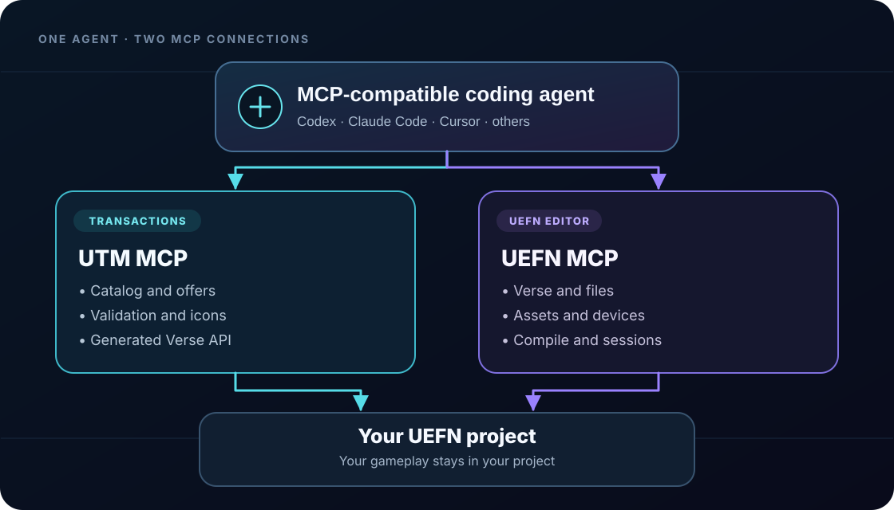
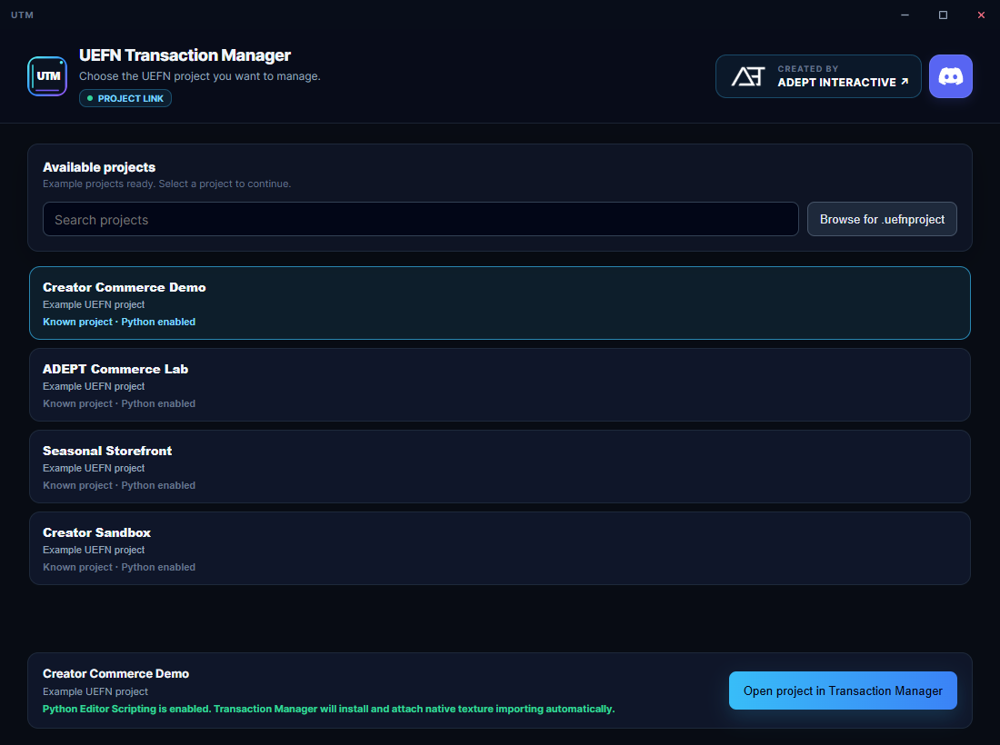
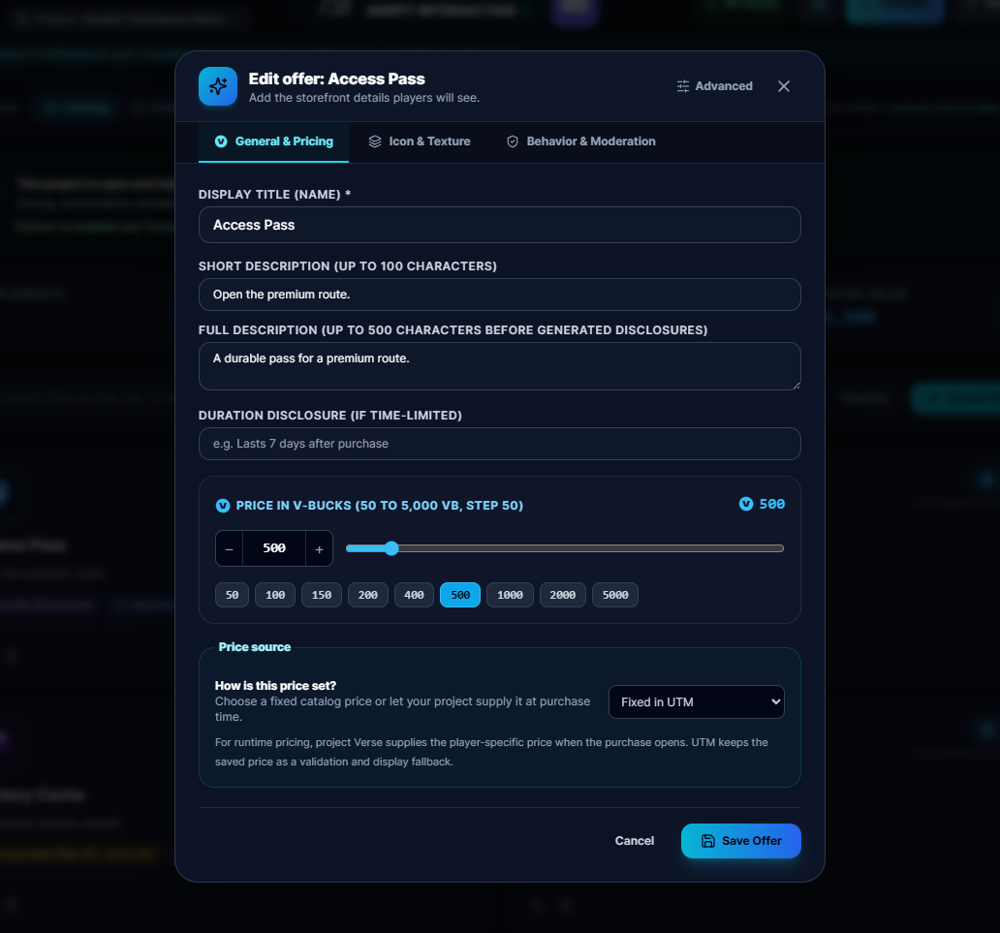
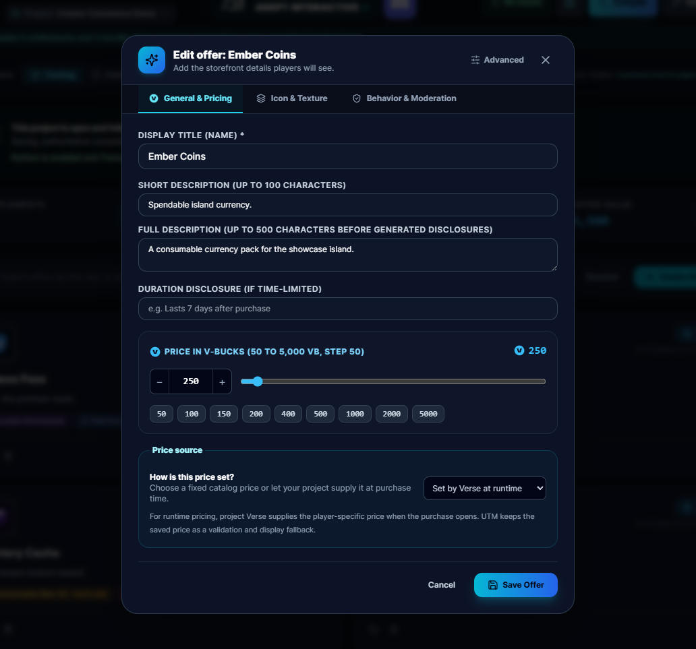
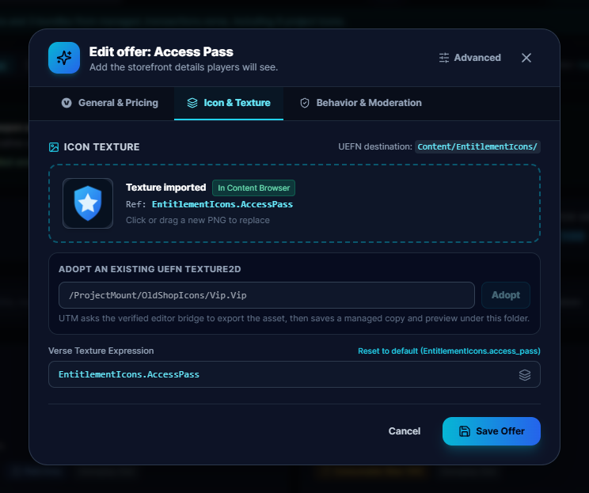
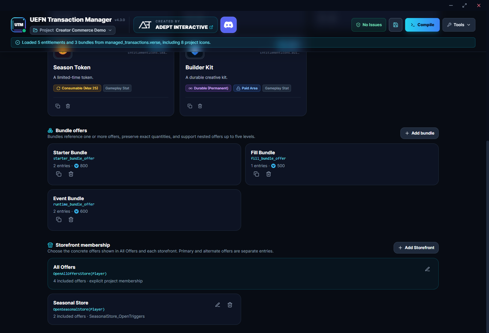
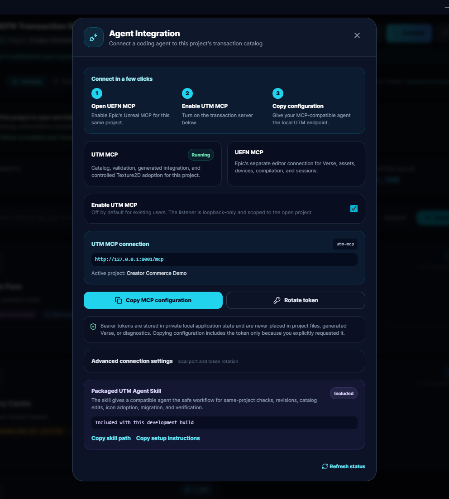
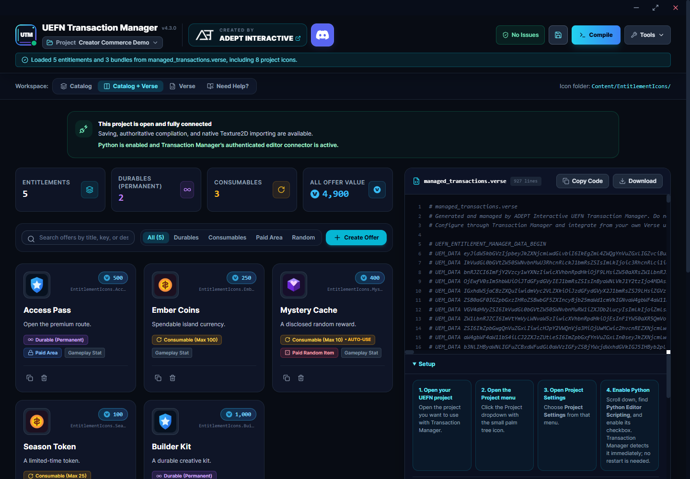
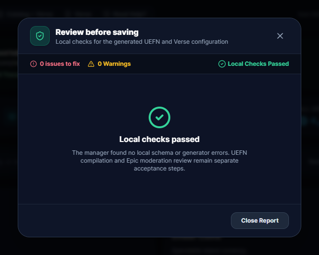
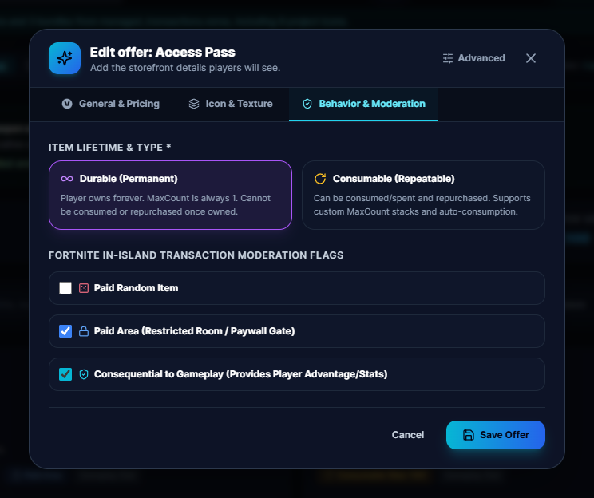

<div align="center">
  
  <h1>UEFN Transaction Manager</h1>
  <p><strong>A visual tool for building and managing Fortnite in-island transactions in UEFN.</strong></p>
  <p>
    
    
    
    <a href="https://discord.gg/playadept"></a>
    <a href="LICENSE"></a>
  </p>
  <p>
    <a href="https://github.com/ADEPT-Interactive/UEFN-Transaction-Manager/releases/latest/download/UEFN-Transaction-Manager-Installer.exe">Download Installer</a>
    &nbsp;&bull;&nbsp;
    <a href="https://github.com/ADEPT-Interactive/UEFN-Transaction-Manager/releases/latest/download/UEFN-Transaction-Manager-Portable.zip">Portable ZIP</a>
    &nbsp;&bull;&nbsp;
    <a href="https://discord.gg/playadept">Community Discord</a>
    &nbsp;&bull;&nbsp;
    <a href="https://github.com/ADEPT-Interactive/UEFN-Transaction-Manager/releases/latest">Latest release</a>
  </p>
</div>

UEFN Transaction Manager is a visual companion for creators who want to design, validate, and connect Fortnite in-island transactions without hand-maintaining the transaction layer. Create entitlements, offers, bundles, storefronts, dynamic purchases, icons, and generated Verse integrations from one project-scoped catalog.


## Why creators use UTM

- Build a believable transaction catalog visually instead of hand-editing Marketplace plumbing.
- Configure durable and consumable entitlements, alternate offers, prices, restrictions, disclosures, ownership limits, and gameplay-facing flags.
- Compose fixed bundles, fill-to-max bundles, runtime-quantity bundles, and storefronts.
- Use runtime prices and quantities calculated by your own Verse while UTM validates the final values and generates the integration surface.
- Import supported artwork or adopt existing UEFN `Texture2D` assets into the managed icon workflow.
- Generate the managed Verse device, purchase helpers, ownership queries, grants, consumption helpers, and state notifications.
- Review local validation and advisory moderation guidance before compiling and testing in UEFN.

## Built for agentic UEFN workflows

UTM 4.3 adds an optional transaction-aware workflow for MCP-compatible coding agents such as Codex, Claude Code, and Cursor. UEFN provides [UEFN MCP](https://dev.epicgames.com/documentation/fortnite/uefn-mcp), an editor connection for Verse, assets, devices, compilation, and sessions. UTM provides **UTM MCP**, a separate local connection for the transaction catalog.

<p align="center"></p>

The agent can coordinate both surfaces while the ownership boundary stays clear: UTM owns transaction intent and plumbing, UEFN owns editor automation, and your project Verse owns gameplay rules, rewards, eligibility, progression, and UI. UTM is an independent tool and is not endorsed by or affiliated with Epic Games. UEFN and Fortnite are products of Epic Games.

## Existing-project migration

Already have a Marketplace transaction layer in Verse? With UTM MCP and UEFN MCP connected to the same project, a compatible coding agent can inspect the existing implementation, map its transaction meaning into a UTM catalog, adopt real project `Texture2D` icons, rewrite project callers against UTM's generated contract, and compile the result.

The workflow preserves gameplay-specific calculations and consequences in your own Verse. It does not guess through ambiguous transaction semantics: if ownership, offer meaning, bundle contents, or runtime behavior cannot be inferred safely, the agent stops for review. See the [existing-project adoption guidance](docs/AGENT_INTEGRATION.md#move-an-existing-transaction-layer) for the practical workflow.

## Download and install

**Recommended: [Download the Windows installer](https://github.com/ADEPT-Interactive/UEFN-Transaction-Manager/releases/latest/download/UEFN-Transaction-Manager-Installer.exe)**

The installer is a per-user Windows x64 application. It does not require administrator access, Node.js, Python, or a separate runtime installation. The [Portable ZIP](https://github.com/ADEPT-Interactive/UEFN-Transaction-Manager/releases/latest/download/UEFN-Transaction-Manager-Portable.zip) is a secondary option for testing or environments where you do not want an installed copy. Both links use stable latest-release aliases.

## Requirements

- Windows x64.
- UEFN installed for project connection and Verse compilation.
- The target `.uefnproject` open in UEFN when you save, compile, or import artwork.
- **Python Editor Scripting** enabled in the UEFN project for native icon import or `Texture2D` adoption.
- An MCP-compatible coding agent only if you want to use Agent Integration.

## Quick start

1. Open the UEFN project you want to work on.
2. [Download and run the installer](https://github.com/ADEPT-Interactive/UEFN-Transaction-Manager/releases/latest/download/UEFN-Transaction-Manager-Installer.exe).
3. Select the open project, choose a recent project, or browse to its `.uefnproject` file.
4. Confirm the project and create your first entitlement or offer.

<p align="center">
  
</p>
<p align="center"><em>Choose the project that should receive the catalog and generated Verse.</em></p>

## Build the catalog

Start with an entitlement, then configure its primary offer. Add alternate offers when the same entitlement needs a different price, restriction, or presentation. Use bundles for grouped purchases and storefronts for the exact offers you want to present together.

<p align="center">
  
  
</p>

Prices are entered as V-Bucks. UTM allocates the stable Verse identity used by generated helpers; changing a display name does not rename that integration surface. Trigger and Button bindings are explicit, so a purchase flow starts from a deliberate player interaction rather than automatic zone entry.

### A guided first offer

When you create a new offer, UTM walks you through **General & Pricing**, **Icon & Texture**, and **Behavior & Moderation** before **Save Offer** becomes available. Templates arrive prefilled, but still pass through the same review. Existing offers remain freeform to edit, so advanced creators can move directly to the section they need.

### Runtime prices and quantities

Some offers need values supplied by gameplay, such as a price calculated from progression or a bundle quantity calculated from current ownership. Mark the offer for runtime values, then pass the generated options type from your project Verse when opening the purchase. UTM validates the allowed range before the Marketplace interface opens.

Fill-to-max bundles calculate the remaining quantity from current ownership. Runtime-quantity bundles let your Verse supply positive quantities for configured entries. Runtime-configured bundles are direct purchases and are not added to storefront displays. The [Generated Verse reference](docs/GENERATED_VERSE_REFERENCE.md) shows the generated option shapes.

### Icons and UEFN project assets

To import artwork into the Content Browser:

1. In UEFN, open the palm-tree **Project** menu.
2. Choose **Project Settings**.
3. Enable **Python Editor Scripting**.
4. Keep UEFN and UTM connected to the same project.
5. Add or edit an icon and confirm the import.

Power-of-two PNGs are kept unchanged. Other supported raster images are normalized and scaled uniformly, with transparent padding only when needed to preserve proportions. New offers start with a built-in square placeholder Texture2D so generated Verse has a valid icon reference; replace it with a custom icon when your artwork is ready. The Icon tab can also adopt a verified UEFN `Texture2D` object path; do not enter a Windows filesystem path or edit `.uasset` files manually.

<p align="center">
  
</p>

### Bundles and storefronts

Bundles preserve configured order and quantities, including nested and dynamic behavior. Storefront membership is explicit, so you choose exactly which primary offers, alternate offers, and static bundles appear in All Offers or a storefront.

<p align="center">
  
</p>

## Agent Integration

Agent Integration is optional. It adds UTM MCP to the open project while UEFN MCP remains the editor-side connection.

1. Enable UEFN MCP in the UEFN project using [Epic's setup guide](https://dev.epicgames.com/documentation/fortnite/uefn-mcp).
2. In UTM, open **Tools -> Agent Integration**.
3. Enable **UTM MCP**.
4. Choose **Copy MCP configuration**. UTM supplies the local endpoint and bearer configuration; keep the copied configuration private.
5. Install or use the packaged [UTM Agent Skill](docs/AGENT_INTEGRATION.md#agent-skill) using the client-specific destination shown in the guide.
6. Connect a compatible coding agent to both UTM MCP and UEFN MCP, then verify both identify the same project before making changes.

<p align="center">
  
</p>

The packaged Agent Skill teaches the safe workflow for catalog creation, revision-aware edits, UTM-managed Verse identities, icon adoption, generated-contract inspection, existing-project migration, compilation, and ambiguity checks. MCP support and Agent Skill support are separate capabilities; a client that can connect to UTM MCP does not automatically discover the skill. Read the [Agent Integration guide](docs/AGENT_INTEGRATION.md) for client setup, same-project safety, and troubleshooting.

## Compile and connect generated Verse

When the catalog is ready:

1. Resolve validation errors and review warnings.
2. Choose **Save** to persist the catalog and update `managed_transactions.verse`.
3. Choose **Compile** while the target project is open in UEFN.
4. Find the generated `managed_transactions_device` in the Content Browser and place it in your island.
5. Assign generated Trigger or Button arrays in the device details panel when you use those bindings.
6. Reference the placed device from your own Verse and connect purchases to your gameplay systems.

<p align="center">
  
</p>

The generated device is the supported integration surface. For an entitlement with the stable key `access_pass`, project Verse can use helpers shaped like these:

```verse
using { /Fortnite.com/Devices }

my_game_device := class(creative_device):
    @editable
    Transactions : managed_transactions_device = managed_transactions_device{}

    BuyAccess(Player:player):void =
        Transactions.OpenAccessPassPurchase(Player)

    CheckAccess(Player:player)<suspends>:void =
        OwnedCount := Transactions.GetAccessPassCount(Player)
        # Apply your game's access rules using OwnedCount.

    WatchAccess()<suspends>:void =
        loop:
            Grant := Transactions.AwaitAccessPassGrantedEvent()
            HandleAccessGranted(Grant)
```

Keep `managed_transactions.verse` manager-owned. Put rewards, eligibility, progression, saved state, and game-specific UI in your own Verse. See the [Generated Verse reference](docs/GENERATED_VERSE_REFERENCE.md) for runtime options, ownership, events, grants, consumption, and device bindings.

## Validation and testing

Errors prevent invalid catalog data from being saved or compiled. Warnings are review aids and do not guarantee Marketplace approval. Transaction Manager's odds field is optional, but paid-random offers still need accurate numerical odds disclosed to players before purchase; if the field is empty, provide that disclosure elsewhere in your island and clearly direct players there.

<p align="center">
  
  
</p>

A successful Verse compile proves that the generated code compiles. It does not prove that gameplay grants the intended reward, a purchase flow works in a live session, or an island will be approved. Test purchases, cancellations, refunds, consumption, saved state, and rejoin behavior in a real UEFN session before publishing.

## Troubleshooting and limits

### The project is not connected

Use **Open project in UEFN** in the connection banner when it is available. UTM asks Windows to open the same selected `.uefnproject` through the registered UEFN association. If Windows reports that no application is associated, repair the UEFN installation or open the project from the launcher. Close duplicate UEFN sessions if more than one project is open.

### Icon import is unavailable

Enable **Python Editor Scripting** in the project settings, then confirm UEFN and UTM target the same project. Native import requires the editor connection to remain available while the import is confirmed.

### A generated device field is missing

Compile successfully, refresh the UEFN Content Browser, and confirm that you placed the generated device from the target project. Some generated device reference arrays may still require manual UEFN wiring when the current UEFN MCP representation cannot assign them reliably.

### An agent cannot see both servers

Confirm UEFN MCP is enabled, UTM MCP is enabled, and the agent was started from the project/workspace context expected by that client. Compare both servers' project context before mutation. If UEFN's refresh or session command is unavailable, save, run a full compile, and restart the editor session as described in the [Agent Integration guide](docs/AGENT_INTEGRATION.md#current-uefn-mcp-limits).

## Documentation and support

- [Agent Integration guide](docs/AGENT_INTEGRATION.md) for UTM MCP, UEFN MCP, the packaged skill, migration, and limits.
- [Generated Verse reference](docs/GENERATED_VERSE_REFERENCE.md) for the current generated contract and common integration patterns.
- [Epic's UEFN MCP documentation](https://dev.epicgames.com/documentation/fortnite/uefn-mcp).
- [Epic's In-Island Transactions documentation](https://dev.epicgames.com/documentation/en-us/fortnite/in-island-transactions-in-fortnite).
- [Epic's Creating Items and Offers guide](https://dev.epicgames.com/documentation/en-us/fortnite/creating-items-and-offers-in-fortnite).
- [Epic's In-Island Transactions restrictions](https://dev.epicgames.com/documentation/en-us/fortnite/in-island-transactions-restrictions-in-fortnite).
- [Contribution guide](CONTRIBUTING.md) for developers working from source.
- [Security policy](SECURITY.md) for reporting a security issue.

Ask questions and share feedback in the [ADEPT Community Discord](https://discord.gg/playadept), or open an issue in this repository with a reproducible problem.

## Contributing

The repository is source-available. Before submitting a contribution, read [CONTRIBUTING.md](CONTRIBUTING.md) and complete the required [CLA acceptance process](CLA-ACCEPTANCE.md). Keep changes focused and include the relevant automated or live UEFN evidence.

## License

Copyright © 2026 AD3PT Interactive Inc., operating as ADEPT Interactive and ADEPT.

This project uses the [ADEPT Source-Available License](LICENSE). Viewing, private evaluation, and contribution through the official repository are permitted. The license does not permit unauthorized redistribution, derivative releases, repackaging, embedding, commercialization, or branding use.

UEFN and Fortnite are products of Epic Games. UEFN Transaction Manager is an independent community tool and is not endorsed by or affiliated with Epic Games.
