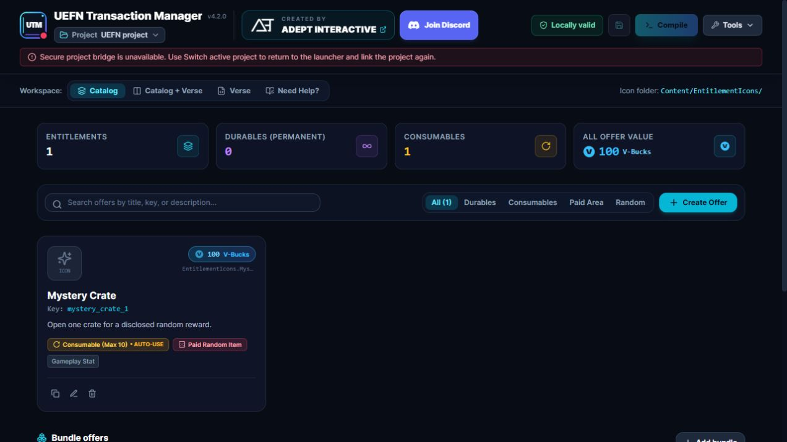
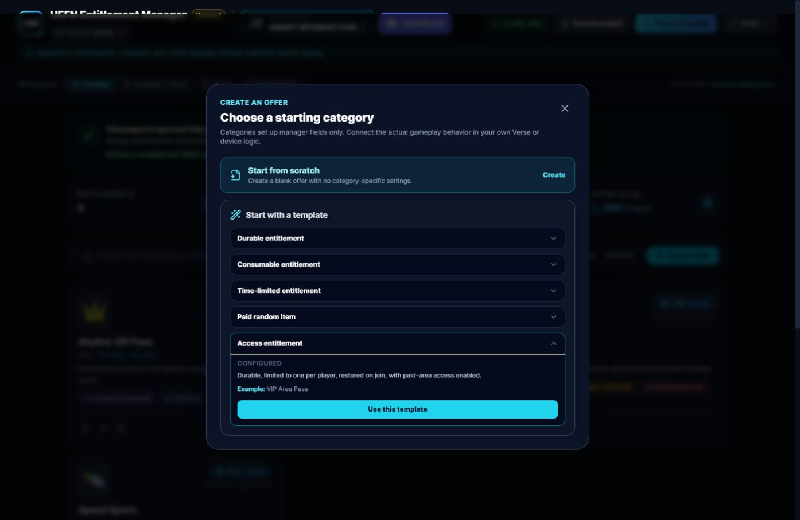
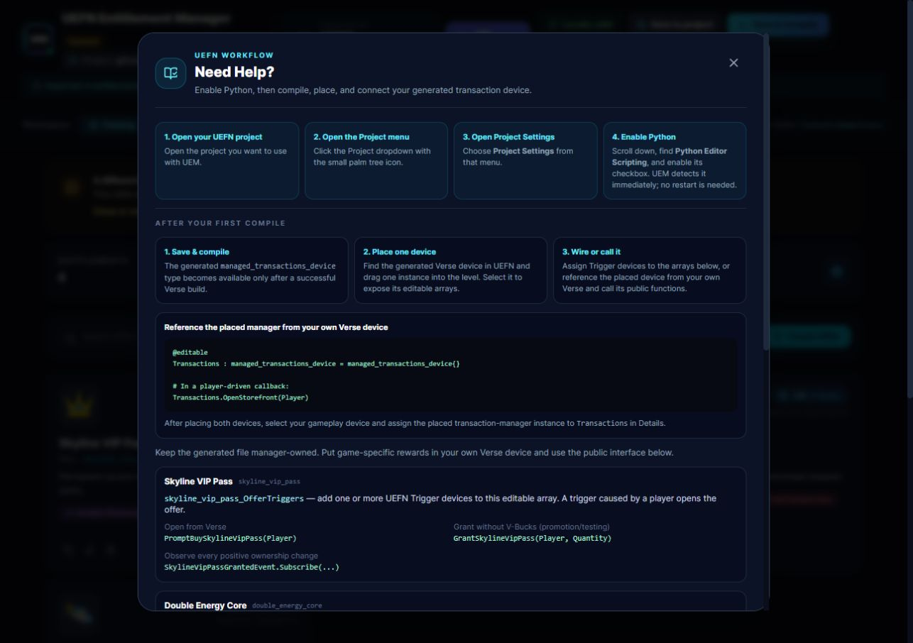

<div align="center">
  
  <h1>UEFN Transaction Manager</h1>
  <p><strong>Build and manage an in-island transaction catalog without hand-writing the full Verse implementation.</strong></p>
  <p>
    
    
    
    <a href="https://discord.gg/playadept"></a>
    <a href="LICENSE"></a>
  </p>
  <p>
    <a href="https://adeptinteractive.net">ADEPT Interactive</a>
    &nbsp;&bull;&nbsp;
    <a href="https://discord.gg/playadept">Community Discord</a>
    &nbsp;&bull;&nbsp;
    <a href="https://github.com/ADEPT-Interactive/UEFN-Transaction-Manager/releases/latest">Latest release</a>
  </p>
</div>

UEFN Transaction Manager is a Windows desktop companion for Fortnite creators using In-Island Transactions. It links directly to the UEFN project you have open, turns entitlements, offers, alternate offers, bundles, storefronts, pricing, restrictions, and gameplay hooks into project-ready Verse, then saves and compiles it through that live UEFN session.



## Connected directly to UEFN

Transaction Manager is more than a standalone Verse generator. Its launcher finds active and recent `.uefnproject` files, confirms the project you intend to edit, and starts a local project bridge restricted to that project's `Content` directory. **Save**, then **Compile** writes the generated Verse with a backup and requests a real compile from the Verse Workflow Server running with UEFN.

When Python Editor Scripting is enabled, Transaction Manager also installs and attaches its project connector automatically. Confirmed supported raster images enter UEFN's editor import queue and are created as native Texture2D assets in the Content Browser. Existing project Texture2D assets can also be adopted through Unreal's editor export API, then pass through the same normalization/import queue. Connection status in the app shows whether the selected project is open and the editor connector is attached, while **Compile** reports UEFN's compile result directly.

Verse compilation discovers the active UEFN-owned loopback Workflow Server session at runtime. Transaction Manager does not require users to configure a port, does not launch VS Code for compilation, and refuses ambiguous or non-local endpoints. UEFN must be running with the linked project loaded. Developers and automated tests may use the loopback-only `UEM_VERSE_COMPILER_ENDPOINT=host:port` override; normal users should not configure it. See [Verse compiler portability](docs/VERSE_COMPILER_PORTABILITY.md) for the discovery contract and diagnostic states. The reusable standalone interoperability project is [ADEPT-Interactive/uefn-verse-compiler](https://github.com/ADEPT-Interactive/uefn-verse-compiler).

## What it helps you do

- Create durable, consumable, time-limited, access, and paid-random entitlements.
- Build individual offers, alternate variants, nested bundles, and focused storefront displays with explicit offer membership.
- Configure V-Bucks prices, age requirements, country restrictions, and platform restrictions.
- Configure runtime-priced direct, alternate, and bundle offers with typed Verse options and preflight validation.
- Import supported raster artwork as native Texture2D assets, or adopt an existing UEFN Texture2D through the editor bridge.
- Generate canonical stable-key-based grant, removal, and reconciliation events for your gameplay code.
- Use deliberate Trigger bindings by default, with optional Purchase Button bindings under Advanced settings. Passive zone entry is not a purchase binding.
- Save and reopen each project's catalog without rebuilding it from scratch.
- Save the generated Verse and request a compile from the connected UEFN session.
- Review schema errors and advisory moderation warnings before testing your island.

Moderation warnings are review aids. They never block entitlement creation or saving, and they do not guarantee Epic approval.

## Download and start

1. Download `UEFN-Transaction-Manager-Setup.exe` from the [latest release](https://github.com/ADEPT-Interactive/UEFN-Transaction-Manager/releases/latest), or use the [direct installer download](https://github.com/ADEPT-Interactive/UEFN-Transaction-Manager/releases/latest/download/UEFN-Transaction-Manager-Setup.exe).
2. Run the installer. Transaction Manager installs per user without requiring administrator access.
3. Launch `UEFN Transaction Manager` from Windows Start/Search.
4. Select the project that is open in UEFN, choose a recent project, or browse to a `.uefnproject` file.
5. Confirm the project and begin building the catalog.

The launcher shows known projects immediately, then continues looking for projects across local fixed drives in the background. Network, optical, and removable drives are not traversed automatically.

The installer registers Transaction Manager with Windows Start/Search and Add or Remove Programs. Transaction Manager checks for stable ADEPT update-service updates in the background after the launcher is usable. Use Tools, then Check for Updates for a manual check. Updates download through Transaction Manager and can be applied with Restart and Install.

`UEFN-Transaction-Manager-Portable.zip` remains available as a secondary diagnostic and emergency portable artifact. The installer is the normal user download.

## Typical creator workflow

1. Add entitlements and configure their prices, limits, descriptions, icons, and gameplay options.
2. Add bundles or focused storefronts when your catalog needs them, then edit Storefront membership to choose the concrete offers shown in All Offers and each focused store.
3. Resolve any validation errors and review advisory warnings.
4. Select **Save**, then **Compile** to update `managed_transactions.verse` and compile it in UEFN.
5. Find the generated `managed_transactions_device` in UEFN's Content Browser and place it in your island.
6. Connect the generated Trigger arrays or public events and functions to your gameplay systems.
7. Test purchases, cancellations, refunds, consumption, saved state, and rejoin behavior in a real UEFN session.

Transaction Manager creates the transaction interface, but your project remains responsible for granting gameplay benefits and reconciling saved player state.

## Marketplace validation

Transaction Manager validates known Marketplace and generator constraints before it writes generated Verse. Errors block generated-file save and compilation, while warnings keep the project usable and call out responsibilities Transaction Manager cannot verify, such as external paid-random odds disclosure. The manager does not round prices, truncate text, or require odds to be entered in its optional paid-random field.

The current checks follow Epic's [Creating Items and Offers](https://dev.epicgames.com/documentation/en-us/fortnite/creating-items-and-offers-in-fortnite) and [In-Island Transactions Restrictions](https://dev.epicgames.com/documentation/en-us/fortnite/in-island-transactions-restrictions-in-fortnite) guidance for price, text, MaxCount, bundle depth, entitlement identifiers, restrictions, and paid-random classification. Transaction Manager-specific validation also protects stable Verse identifiers, generated symbols, explicit storefront membership, and runtime offer values. Runtime-configured bundles remain direct purchase only; the compatibility-preserving fill-to-max shape is one entitlement at quantity 1, while runtime quantity bundles expose typed values and reject zero or over-limit entries before opening Marketplace.

## Generated Verse API

Projects generate canonical symbols from each persisted `verseKey`, so changing a display name does not rename the integration surface. For an entitlement with key `durable_entitlement`, use:

```verse
Transactions.OpenDurableEntitlementPurchase(Player)
```

Transaction Manager's generated notification values are native user-created Verse `event(t)` values. Verse 42.00 does not support aliasing a private instance event to a public `awaitable(t)` member, so Transaction Manager exposes small public suspending await functions while keeping the signal-capable events private. They are recurring notifications, so wait for each next signal from a suspending watcher:

```verse
OnBegin<override>()<suspends>:void =
    spawn{WatchDurableEntitlementGranted()}

WatchDurableEntitlementGranted()<suspends>:void =
    loop:
        Grant := Transactions.AwaitDurableEntitlementGrantedEvent()
        HandleDurableEntitlementGranted(Grant)
```

Transaction Manager custom notification values use the generated `Await<StableKeyStem>GrantedEvent()` / `RemovedEvent()` / `ReconciledEvent()` functions, backed by native `.Await()` calls, not `.Subscribe()`. Epic-provided device/listenable events such as button, trigger, and playspace events remain separate APIs and may support `.Subscribe()`.

The global storefront helper is `OpenAllOffersStore(Player)`. Its offer collection is explicit project configuration, not an automatic list of every offer. Focused storefronts use `Open<StableKeyStem>(Player)` and each has its own ordered membership. Primary and alternate offers are separate Marketplace entries, while static bundles can be included like any other eligible offer. Dynamic remaining-quantity bundles are direct-purchase-only and cannot be added to a storefront. `_GrantedEvent` means every positive entitlement delta, including a direct grant, not only a purchase.

Use the generated device from your own Verse for both event integration and current Marketplace queries:

```verse
using { /Fortnite.com/Devices }

my_game_device := class(creative_device):
    @editable
    Transactions : managed_transactions_device = managed_transactions_device{}

    OnBegin<override>()<suspends>:void =
        spawn{WatchAccessPassGranted()}

    WatchAccessPassGranted()<suspends>:void =
        loop:
            Grant := Transactions.AwaitAccessPassGrantedEvent()
            OnAccessPassGranted(Grant)

    CheckAccess(Player:player)<suspends>:void =
        OwnedCount := Transactions.GetAccessPassCount(Player)
        # Apply game-specific state from OwnedCount in this external device.

    GrantAccess(Player:player)<suspends>:void =
        GrantSucceeded := Transactions.GrantAccessPass(Player, 1)
        if (GrantSucceeded?):
            Print("Marketplace grant accepted")
```

`GetAccessPassCount` and `HasAccessPass` query current Marketplace state. The same `Get<StableKeyStem>Count` and `Has<StableKeyStem>` helpers are generated for consumables; `HasX` means the current count is greater than zero. Alternate offers share the parent entitlement's helpers, while bundles and storefronts do not get ownership helpers.

`Grant<StableKeyStem>` and consumable `Consume<StableKeyStem>` helpers are suspending and return the native Marketplace operation result as `logic`. A `true` result reports only that the operation succeeded at the Marketplace API boundary. It is not a replacement for awaiting the canonical `<StableKeyStem>_GrantedEvent` or `<StableKeyStem>_RemovedEvent`, which remain the authoritative gameplay-state signals. Non-positive quantities return `false` without calling Marketplace. Keep `managed_transactions.verse` manager-owned and do not edit it manually.

For troubleshooting, enable **Enable Debug Logging** on the generated Transaction Manager device in UEFN to emit additional runtime diagnostics.

The generated file also contains configured modules such as `ManagedEntitlementInfo`, `ManagedEntitlements`, `ManagedTransactionPrices`, `ManagedOffers`, and `EntitlementIcons`. These are generated Marketplace plumbing, not a second Transaction Manager API. Use the generated device for runtime integration instead of calling raw generated entitlement, offer, price, metadata, or icon declarations directly. Transaction Manager does not guarantee those generated module or asset member names as supported API.

Transaction Manager supports one generated API. Existing manifests from supported schemas, including manifests produced during pre-release API development, are loaded as project data and regenerated with the same current canonical symbols. Obsolete generated-API metadata and purchase-event fields are ignored when reading and are not written to new manifests.

## Native icon import

To import PNGs directly into the UEFN Content Browser:

1. Open the UEFN project.
2. Open the **Project** menu using the palm-tree icon.
3. Select **Project Settings**.
4. Scroll to **Python Editor Scripting** and enable it.

No restart is needed. Transaction Manager installs and connects the project helper automatically when the project is linked.

Power-of-two PNGs are imported without any modification. Other supported raster images are normalized to canonical PNG, then scaled uniformly to the closest suitable power-of-two shape. Transparent edge space is added only when it is necessary to preserve the original aspect ratio, so artwork is never stretched or squashed. The Icon tab also accepts a verified project Texture2D object path such as `/MyProject/Icons/VipPass.VipPass`; filesystem paths and `.uasset` byte parsing are rejected.

## Phase 28 showcase and capability boundary

The deterministic showcase catalog and original vector icon sources are in [docs/showcase](docs/showcase/README.md). The implementation boundary between local validation, UEFN compile acceptance, and gameplay acceptance is recorded in the [Phase 28 capability matrix](docs/PHASE28_CAPABILITY_MATRIX.md).

## Templates and in-app help

The included templates provide focused starting points for common entitlement categories. The **Need Help?** panel covers setup, compiling, placing the generated device, and connecting it to your own Verse.





## Important boundaries

- A successful compile confirms Verse compilation, not gameplay correctness or marketplace approval.
- Native texture import must be confirmed in the UEFN Content Browser.
- Voluntary purchase helpers and storefront dialogs call the Fortnite Marketplace APIs normally. Creator-authored sales messaging is outside the entitlement and transaction generator, so messaging restrictions are not used as general purchase-eligibility guards. Configured offer age, country, platform, paid-random, and validator rules remain in force.
- Paid-random offers require accurate numerical odds to be available to players before purchase. Transaction Manager's odds field is optional: use it to add a disclosure to generated descriptions, or disclose the odds elsewhere in your island and clearly direct players there.
- Keep the manager open while using connected save, compile, and import actions.

See [SECURITY.md](SECURITY.md) to report a security issue.

## Build from source

Contributors need Windows, Node.js 22.12.0 or newer, and UEFN for live editor validation.

```powershell
scripts\setup.bat
npm run test:all
powershell -NoProfile -ExecutionPolicy Bypass -File scripts/build-release.ps1
powershell -NoProfile -ExecutionPolicy Bypass -File scripts/verify-release.ps1
```

See [CONTRIBUTING.md](CONTRIBUTING.md) before submitting changes. A release build produces versioned machine-update artifacts, stable human-download aliases, `latest.yml`, the NSIS blockmap, SHA-256 checksums, and an artifact inventory. GitHub Releases carries only the human aliases; the ADEPT update service carries machine-update metadata and versioned installer artifacts. Local builds are unsigned unless a secure Authenticode certificate is supplied through the release environment, so Windows SmartScreen may show an unrecognized-publisher warning.

## License and support

Copyright © 2026 AD3PT Interactive Inc., operating as ADEPT Interactive and ADEPT.

This project uses the [ADEPT Source-Available License](LICENSE). Viewing, private evaluation, and contribution through the official repository are permitted, but unauthorized redistribution, derivative releases, repackaging, embedding, commercialization, and branding use are not.

- [ADEPT Interactive](https://adeptinteractive.net)
- [Discord community](https://discord.gg/playadept)
- [GitHub Sponsors](https://github.com/sponsors/ADEPT-Interactive)
