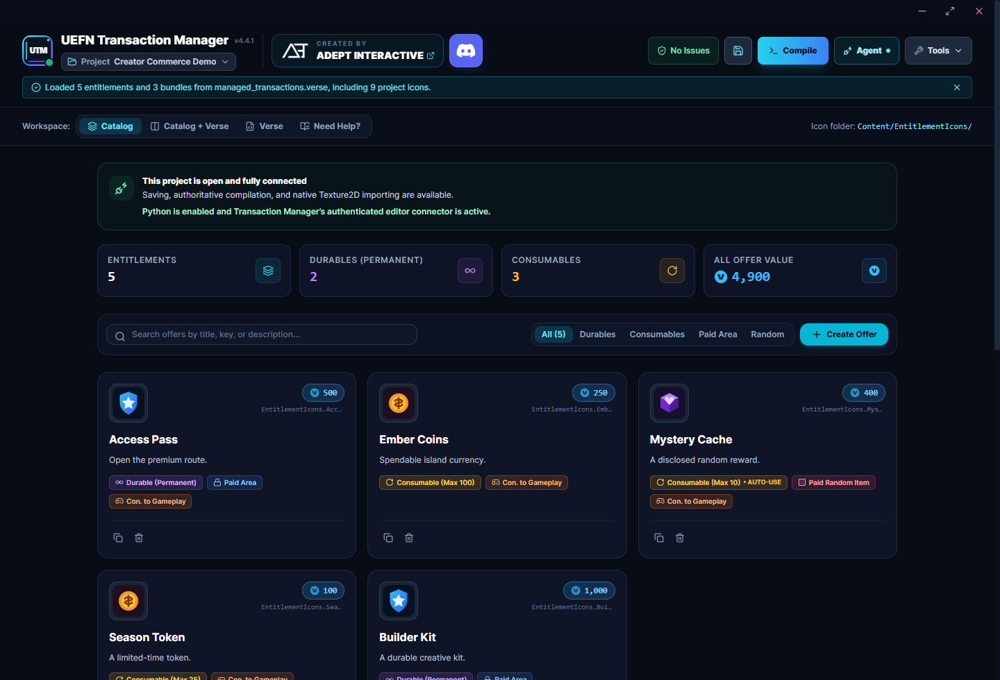

<div align="center">
  
  <h1>UEFN Entitlement Manager</h1>
  <p><strong>Build and manage an in-island transaction catalog without hand-writing the full Verse implementation.</strong></p>
  <p>
    
    
    
    <a href="LICENSE"></a>
  </p>
  <p>
    <a href="https://adeptinteractive.net">ADEPT Interactive</a>
    &nbsp;&bull;&nbsp;
    <a href="https://discord.gg/playadept">Community Discord</a>
    &nbsp;&bull;&nbsp;
    <a href="https://github.com/ADEPT-Interactive/UEFN-Entitlement-Manager/releases/latest">Latest release</a>
  </p>
</div>

UEFN Entitlement Manager is a Windows desktop companion for Fortnite creators using In-Island Transactions. It links directly to the UEFN project you have open, turns entitlement, offer, bundle, display, pricing, restriction, and gameplay-hook choices into project-ready Verse, then saves and compiles it through that live UEFN session.



## Connected directly to UEFN

UEM is more than a standalone Verse generator. Its launcher finds active and recent `.uefnproject` files, confirms the project you intend to edit, and starts a local project bridge restricted to that project's `Content` directory. **Save & Compile** writes the generated Verse with a backup, then requests a real compile from the Verse Workflow Server running with UEFN.

When Python Editor Scripting is enabled, UEM also installs and attaches its project connector automatically. Confirmed PNGs enter UEFN's editor import queue and are created as native Texture2D assets in the Content Browser. Connection status in the app shows whether the selected project is open and the editor connector is attached, while **Save & Compile** reports UEFN's compile result directly.

## What it helps you do

- Create durable, consumable, time-limited, access, and paid-random entitlements.
- Build individual offers, alternate variants, nested bundles, and focused storefront displays.
- Configure V-Bucks prices, age requirements, country restrictions, and platform restrictions.
- Import PNG artwork as native Texture2D assets and use it in generated offers.
- Generate canonical stable-key-based grant, removal, and reconciliation events for your gameplay code.
- Use Trigger bindings by default, with optional Button and Mutator Zone bindings under Advanced settings.
- Save and reopen each project's catalog without rebuilding it from scratch.
- Save the generated Verse and request a compile from the connected UEFN session.
- Review schema errors and advisory moderation warnings before testing your island.

Moderation warnings are review aids. They never block entitlement creation or saving, and they do not guarantee Epic approval.

## Download and start

1. Download `UEFN Entitlement Manager.zip` from the [latest release](https://github.com/ADEPT-Interactive/UEFN-Entitlement-Manager/releases/latest).
2. Extract the complete ZIP to a normal folder and keep its contents together.
3. Open `UEFNEntitlementManager-3.0.1.exe`.
4. Select the project that is open in UEFN, choose a recent project, or browse to a `.uefnproject` file.
5. Confirm the project and begin building the catalog.

The release is a portable Windows x64 app. It does not need an installer, administrator access, or separate Node.js, npm, Python, .NET, WebView2, or browser installation.

## Typical creator workflow

1. Add entitlements and configure their prices, limits, descriptions, icons, and gameplay options.
2. Add bundles or offer displays when your storefront needs them.
3. Resolve any validation errors and review advisory warnings.
4. Select **Save & Compile** to update `managed_transactions.verse` and compile it in UEFN.
5. Place the generated `managed_transactions_device` in your island.
6. Connect the generated Trigger arrays or public events and functions to your gameplay systems.
7. Test purchases, cancellations, refunds, consumption, saved state, and rejoin behavior in a real UEFN session.

UEM creates the transaction interface, but your project remains responsible for granting gameplay benefits and reconciling saved player state.

## Generated Verse API

New projects generate API v2 symbols from each persisted `verseKey`, so changing a display name does not rename the integration surface. For an entitlement with key `durable_entitlement`, use:

```verse
Transactions.OpenDurableEntitlementPurchase(Player)
Transactions.DurableEntitlement_GrantedEvent.Subscribe(OnGranted)
Transactions.DurableEntitlement_RemovedEvent.Subscribe(OnRemoved)
Transactions.DurableEntitlement_ReconciledEvent.Subscribe(OnReconciled)
```

The global storefront helper is `OpenAllOffersStore(Player)`. Focused storefronts use `Open<StableKeyStem>(Player)`. `_GrantedEvent` means every positive entitlement delta, including a direct grant, not only a purchase.

Use the generated device from your own Verse for both event integration and current Marketplace queries:

```verse
using { /Fortnite.com/Devices }

my_game_device := class(creative_device):
    @editable
    Transactions : managed_transactions_device = managed_transactions_device{}

    OnBegin<override>()<suspends>:void =
        Transactions.AccessPass_GrantedEvent.Subscribe(OnAccessPassGranted)

    CheckAccess(Player:player)<suspends>:void =
        OwnedCount := Transactions.GetAccessPassCount(Player)
        # Apply game-specific state from OwnedCount in this external device.

    GrantAccess(Player:player)<suspends>:void =
        GrantSucceeded := Transactions.GrantAccessPass(Player, 1)
        if (GrantSucceeded?):
            Print("Marketplace grant accepted")
```

`GetAccessPassCount` and `HasAccessPass` query current Marketplace state. The same `Get<StableKeyStem>Count` and `Has<StableKeyStem>` helpers are generated for consumables; `HasX` means the current count is greater than zero. Alternate offers share the parent entitlement's helpers, while bundles and storefronts do not get ownership helpers.

API-v2 `Grant<StableKeyStem>` and consumable `Consume<StableKeyStem>` helpers are suspending and return the native Marketplace operation result as `logic`. A `true` result reports only that the operation succeeded at the Marketplace API boundary. It is not a replacement for listening to the canonical `<StableKeyStem>_GrantedEvent` or `<StableKeyStem>_RemovedEvent`, which remain the authoritative gameplay-state signals. Non-positive quantities return `false` without calling Marketplace. Explicit API-v1 output retains its historical `void` Grant/Consume signatures; migrated API-v1 projects receive the canonical API-v2 result-returning functions and their legacy compatibility symbols. Existing standalone calls may ignore the returned value.

UEM automatically migrates manifests without `generatedApiVersion` as API v1. Migrated projects receive the canonical API plus reproducible `PromptBuy...`, legacy event, `OpenStorefront`, and unsafe `Show...` compatibility symbols where possible. New API-v2 projects do not generate those legacy symbols. Keep `managed_transactions.verse` manager-owned and do not edit it manually.

## Native icon import

To import PNGs directly into the UEFN Content Browser:

1. Open the UEFN project.
2. Open the **Project** menu using the palm-tree icon.
3. Select **Project Settings**.
4. Scroll to **Python Editor Scripting** and enable it.

No restart is needed. UEM installs and connects the project helper automatically when the project is linked.

Power-of-two PNGs are imported without any modification. Other sizes are scaled uniformly to the closest suitable power-of-two shape. Transparent edge space is added only when it is necessary to preserve the original aspect ratio, so artwork is never stretched or squashed.

## Templates and in-app help

The included templates provide focused starting points for common entitlement categories. The **Need Help?** panel covers setup, compiling, placing the generated device, and connecting it to your own Verse.


## Important boundaries

- A successful compile confirms Verse compilation, not gameplay correctness or marketplace approval.
- Native texture import must be confirmed in the UEFN Content Browser.
- Voluntary purchase helpers and storefront dialogs call the Fortnite Marketplace APIs normally. Creator-authored sales messaging is outside the entitlement and transaction generator, so messaging restrictions are not used as general purchase-eligibility guards. Configured offer age, country, platform, paid-random, and validator rules remain in force.
- Paid-random offers require accurate numerical odds to be available to players before purchase. UEM's odds field is optional: use it to add a disclosure to generated descriptions, or disclose the odds elsewhere in your island and clearly direct players there.
- Keep the manager open while using connected save, compile, and import actions.

See [SECURITY.md](SECURITY.md) to report a security issue.

## Build from source

Contributors need Windows, Node.js 20 or newer, and UEFN for live editor validation.

```powershell
scripts\setup.bat
npm run test:all
powershell -NoProfile -ExecutionPolicy Bypass -File scripts/build-release.ps1
powershell -NoProfile -ExecutionPolicy Bypass -File scripts/verify-release.ps1
```

See [CONTRIBUTING.md](CONTRIBUTING.md) before submitting changes. The published ZIP includes the applicable third-party notices and license files.

## License and support

Copyright © 2026 AD3PT Interactive Inc., operating as ADEPT Interactive and ADEPT.

This project uses the [ADEPT Source-Available License](LICENSE). Viewing, private evaluation, and contribution through the official repository are permitted, but unauthorized redistribution, derivative releases, repackaging, embedding, commercialization, and branding use are not.

- [ADEPT Interactive](https://adeptinteractive.net)
- [Discord community](https://discord.gg/playadept)
- [GitHub Sponsors](https://github.com/sponsors/ADEPT-Interactive)
