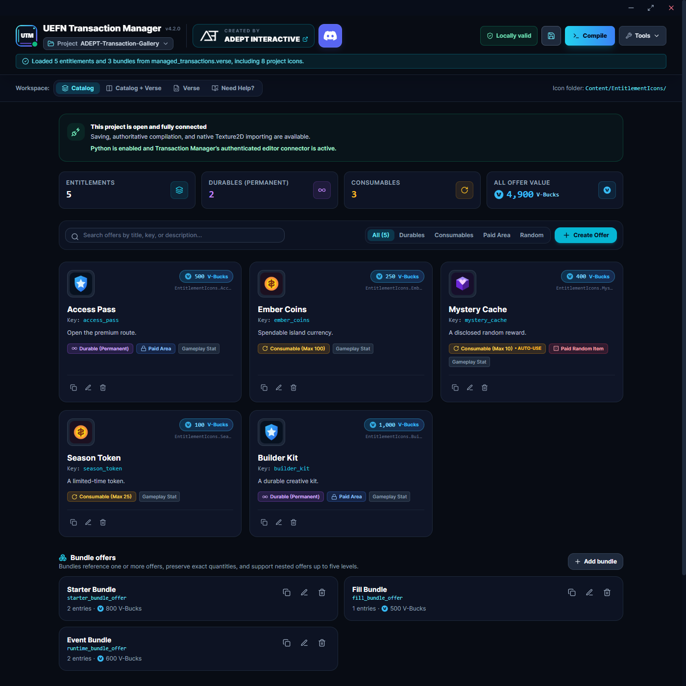
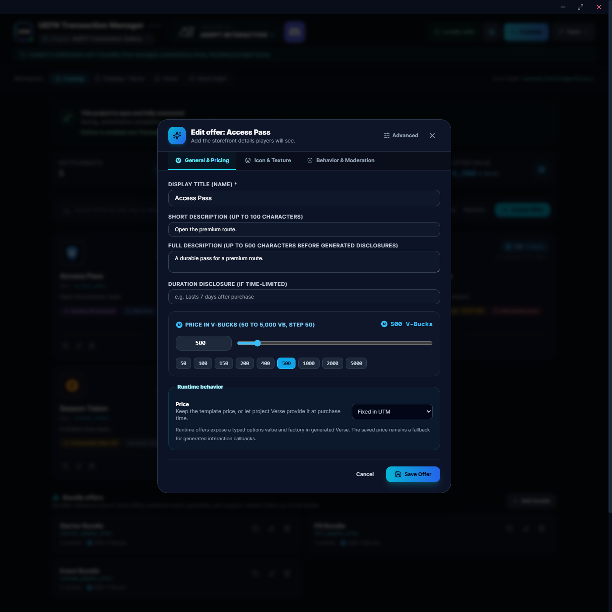
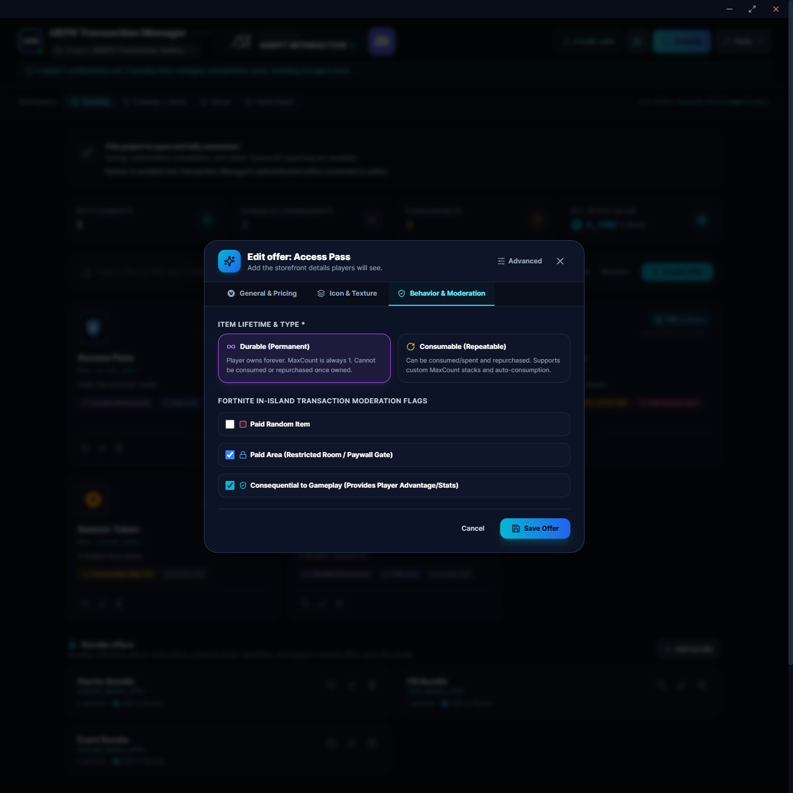
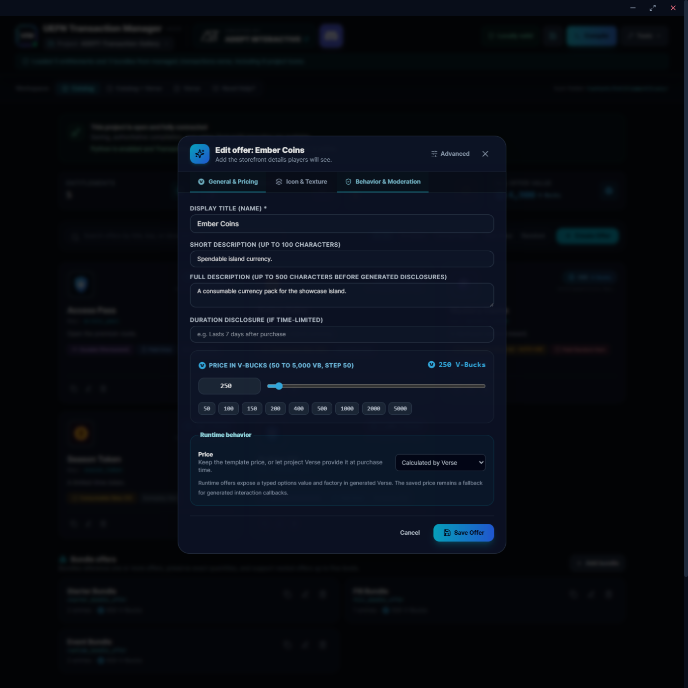
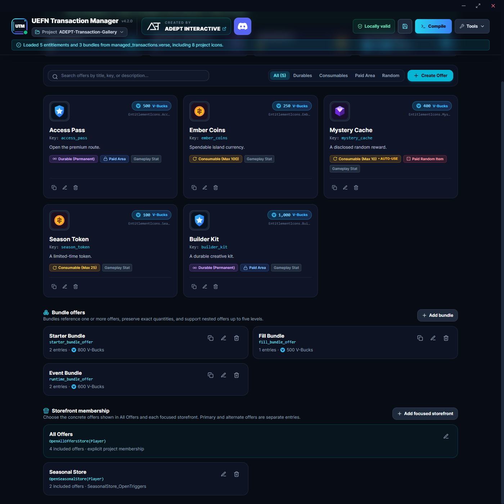
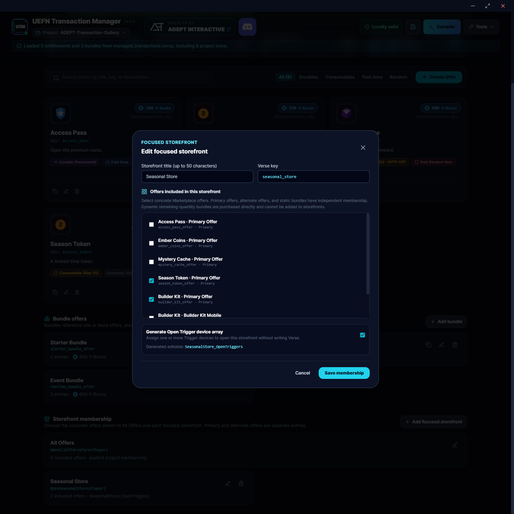
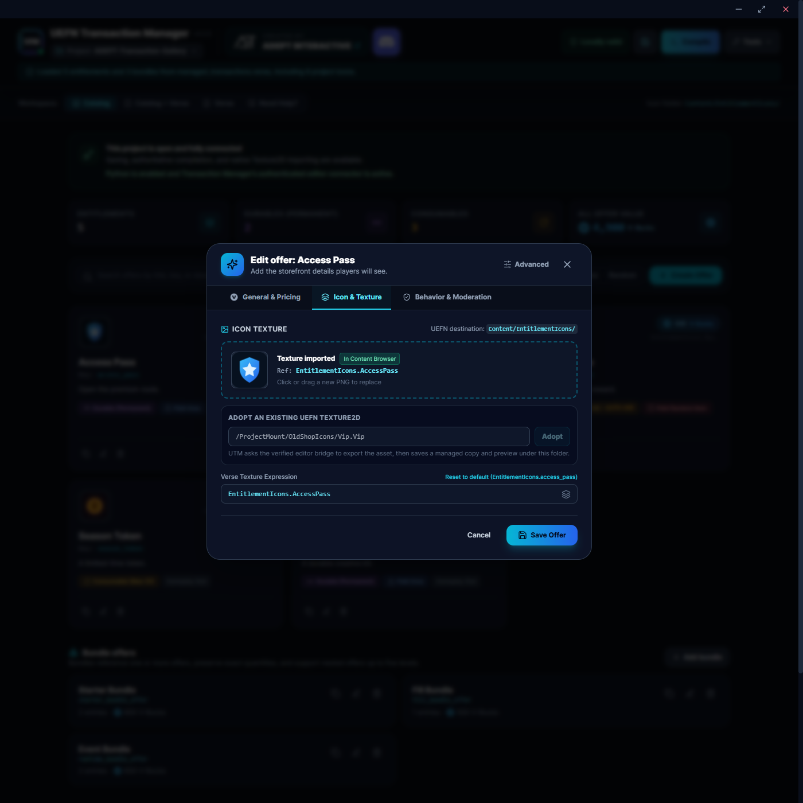
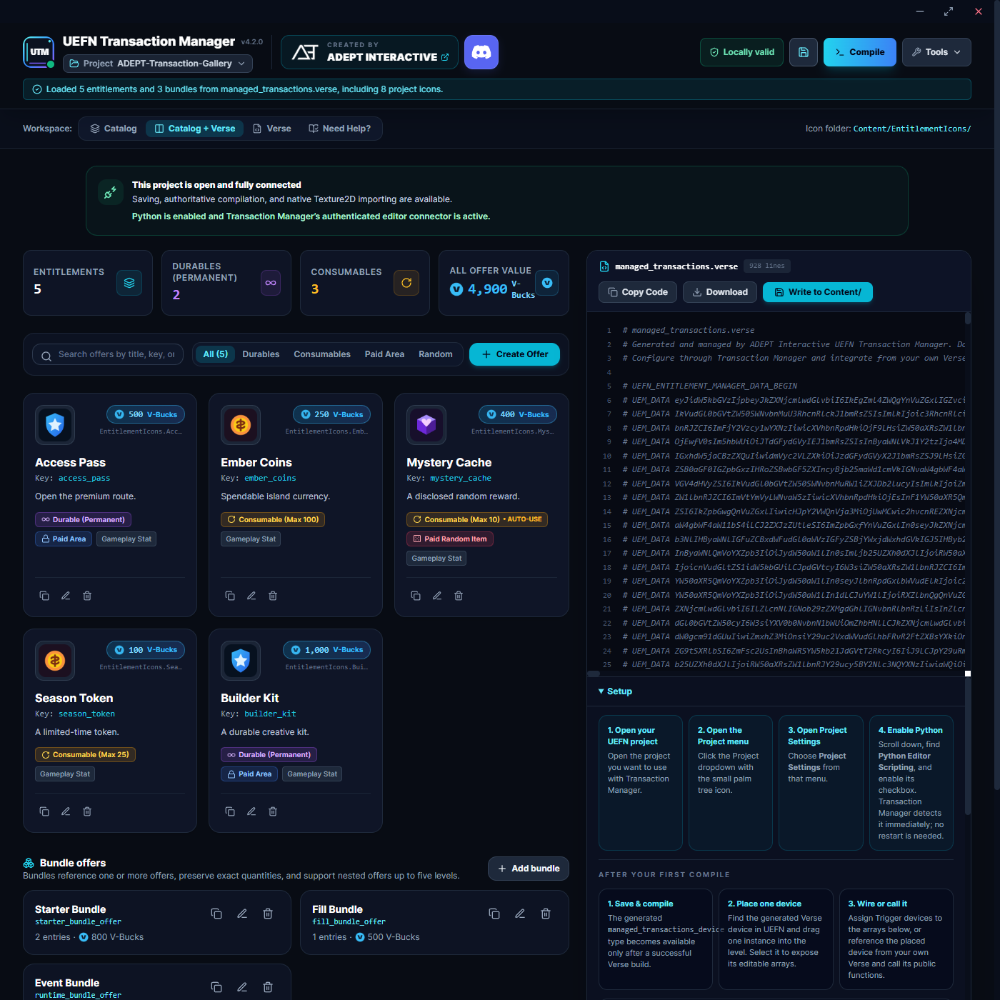
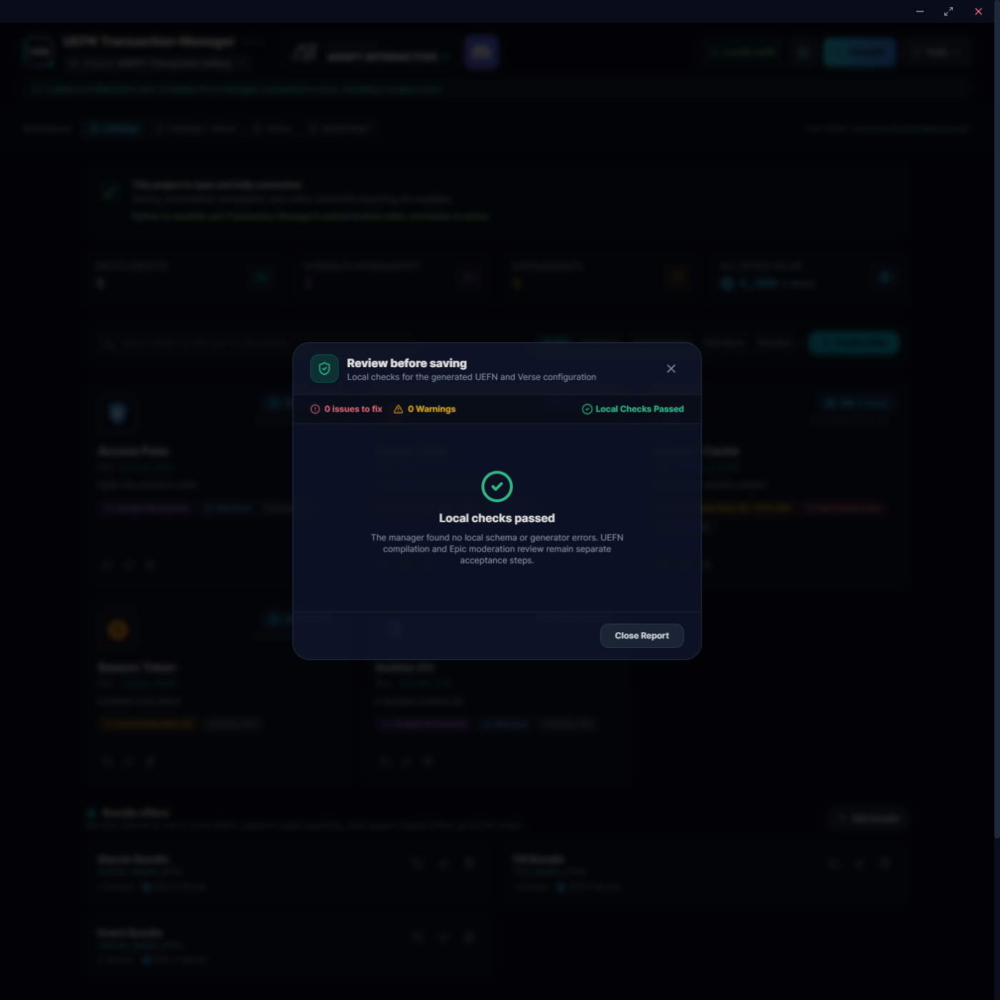

<div align="center">
  
  <h1>UEFN Transaction Manager</h1>
  <p><strong>Build in-island transactions for UEFN with a visual catalog and generated Verse.</strong></p>
  <p>
    
    
    
    <a href="https://discord.gg/playadept"></a>
    <a href="LICENSE"></a>
  </p>
  <p>
    <a href="https://adeptinteractive.net">ADEPT Interactive</a>
    &nbsp;&bull;&nbsp;
    <a href="https://discord.gg/playadept">Community Discord</a>
    &nbsp;&bull;&nbsp;
    <a href="https://github.com/ADEPT-Interactive/UEFN-Transaction-Manager/releases/latest">Latest release</a>
  </p>
</div>

UEFN Transaction Manager is a Windows companion for Fortnite creators who want to design, validate, and connect in-island transactions without hand-writing the full Marketplace integration. Build the catalog in a visual app, generate the Verse for your project, and use the resulting device from your own gameplay code.



## What you can do

- Create durable, consumable, time-limited, access, and paid-random products.
- Set prices, descriptions, icons, ownership limits, age requirements, country restrictions, and platform restrictions.
- Offer primary products, alternate offers, bundles, and focused storefronts.
- Let your project Verse provide runtime prices or bundle quantities when the value depends on gameplay.
- Import supported artwork into the UEFN Content Browser or adopt an existing project Texture2D.
- Generate purchase helpers, ownership queries, grant and consume helpers, and reconciliation events for your own Verse.
- Review validation errors and advisory moderation warnings before testing your island.
- Save the catalog per project and compile the generated Verse through the UEFN project you have open.

## Download

**Recommended: [Download the Windows installer](https://github.com/ADEPT-Interactive/UEFN-Transaction-Manager/releases/latest/download/UEFN-Transaction-Manager-Installer.exe)**

The installer is a per-user Windows x64 application. It does not require administrator access, Node.js, Python, or a separate runtime installation.

The [Portable ZIP](https://github.com/ADEPT-Interactive/UEFN-Transaction-Manager/releases/latest/download/UEFN-Transaction-Manager-Portable.zip) is a secondary option for testing or environments where you do not want an installed copy. Portable builds from before 4.2.0 need to download the latest Portable ZIP once. Starting with 4.2.0, portable updates remain portable and update in the same folder.

## Requirements

- Windows x64.
- UEFN installed for project connection and Verse compilation.
- The target `.uefnproject` open in UEFN when you save, compile, or import artwork.
- **Python Editor Scripting** enabled in the UEFN project when you want native icon import or Texture2D adoption.

The installed application includes its own runtime. You only need Node.js and Python when developing Transaction Manager from source.

## Quick start

1. Open the UEFN project you want to work on.
2. [Download and run the installer](https://github.com/ADEPT-Interactive/UEFN-Transaction-Manager/releases/latest/download/UEFN-Transaction-Manager-Installer.exe).
3. Select the open project, choose a recent project, or browse to its `.uefnproject` file.
4. Confirm the project and create your first product.

Known projects appear immediately. The launcher can continue finding projects on local fixed drives while you work. Network, optical, and removable drives are not scanned automatically.

<p align="center">
  
</p>
<p align="center"><em>Select the project that should receive the catalog and generated Verse.</em></p>

## Build your transaction catalog

Start with an entitlement, choose whether it is durable or consumable, then configure its offer details and gameplay-facing options. Add alternate offers when the same entitlement needs another offer configuration. Add bundles for grouped purchases and storefronts for the offers you want to present together.

Use explicit Trigger or Button bindings for deliberate player interactions. Passive zone entry is not treated as a purchase action.

<p align="center">
  
  
</p>

Prices are entered as V-Bucks. Product names and descriptions are used in the generated offer. A stable project key keeps your Verse helper names consistent even if you later change a display name.

### Runtime prices and quantities

Some offers need values supplied by gameplay, such as a price calculated from progression or a bundle quantity calculated from the player's current state. Mark the offer for runtime values, then pass the generated options type from your project Verse when opening the purchase. Transaction Manager validates the allowed range and rejects invalid values before the Marketplace interface opens.

Fill-to-max bundles calculate the remaining quantity from current ownership. Runtime-quantity bundles let your Verse supply positive quantities for the configured entries. Runtime-configured bundles are direct purchases and are not added to storefront displays.

<p align="center">
  
</p>

See the [Generated Verse reference](docs/GENERATED_VERSE_REFERENCE.md) for concise examples of runtime option types and purchase helpers.

### Bundles and storefronts

Bundles keep their configured order and quantities. Storefront membership is explicit, so you choose exactly which primary offers, alternate offers, and static bundles appear in the all-offers display or in each focused storefront.

<p align="center">
  
  
</p>

## Icons and UEFN project assets

To import artwork into the Content Browser:

1. In UEFN, open the palm-tree **Project** menu.
2. Choose **Project Settings**.
3. Enable **Python Editor Scripting**.
4. Keep UEFN and Transaction Manager connected to the same project.
5. Add or edit an icon in the product editor and confirm the import.

Power-of-two PNGs are kept unchanged. Other supported raster images are normalized and scaled uniformly to a suitable power-of-two shape, with transparent padding only when needed to preserve the original proportions. The Icon tab can also use a verified UEFN Texture2D object path. Do not enter a Windows filesystem path or edit `.uasset` files manually.

<p align="center">
  
</p>

## Compile and connect the generated Verse

When the catalog is ready:

1. Resolve validation errors and review warnings.
2. Choose **Save** to persist the project catalog and update `managed_transactions.verse`.
3. Choose **Compile** while the target project is open in UEFN.
4. In UEFN, find the generated `managed_transactions_device` in the Content Browser and place it in your island.
5. Assign any generated Trigger or Button arrays in the device details panel.
6. Reference the placed device from your own Verse and connect purchases to your gameplay systems.

<p align="center">
  
</p>

The generated device is the supported integration surface. For an entitlement with the stable key `access_pass`, your project Verse can use helpers shaped like these:

```verse
using { /Fortnite.com/Devices }

my_game_device := class(creative_device):
    @editable
    Transactions : managed_transactions_device = managed_transactions_device{}

    BuyAccess(Player:player):void =
        Transactions.OpenAccessPassPurchase(Player)

    CheckAccess(Player:player)<suspends>:void =
        OwnedCount := Transactions.GetAccessPassCount(Player)
        # Apply your game's access rules using OwnedCount.

    WatchAccess()<suspends>:void =
        loop:
            Grant := Transactions.AwaitAccessPassGrantedEvent()
            HandleAccessGranted(Grant)
```

Use the generated `Get<StableKeyStem>Count` and `Has<StableKeyStem>` helpers for current ownership. Use `Grant<StableKeyStem>` or consumable `Consume<StableKeyStem>` only when your game needs a server-side operation. Await the generated grant, removal, and reconciliation functions for authoritative gameplay-state notifications. Runtime-price and runtime-quantity examples are in the [Generated Verse reference](docs/GENERATED_VERSE_REFERENCE.md).

Keep `managed_transactions.verse` manager-owned. Put rewards, eligibility, progression, saved state, and game-specific UI in your own Verse.

## Validation and testing

Errors prevent invalid catalog data from being saved or compiled. Warnings are review aids and do not guarantee Marketplace approval. In particular, paid-random offers still need accurate numerical odds disclosed to players before purchase.

<p align="center">
  
</p>

A successful Verse compile proves that the generated code compiles. It does not prove that your gameplay grants the intended reward, that a purchase flow works in a live session, or that an island will be approved. Test purchases, cancellations, refunds, consumption, saved state, and rejoin behavior in the real UEFN session before publishing.

## Troubleshooting

### The project is not connected

Make sure UEFN is open with the same `.uefnproject` selected in Transaction Manager. Close duplicate UEFN sessions if more than one project is open, then reopen or reconnect the project in the launcher.

### Compile does not start or reports errors

Keep UEFN open with the project loaded, save the catalog first, and read the compiler result in UEFN and Transaction Manager. Fix errors in your own Verse outside the managed file. Do not edit `managed_transactions.verse` by hand.

### Icon import is unavailable

Enable **Python Editor Scripting** in the project's UEFN settings, then confirm that UEFN and Transaction Manager are connected to the same project. Native import also requires the editor connection to remain available while the import is confirmed.

### The generated device or an editable field is missing

Compile successfully, refresh the UEFN Content Browser, and confirm that you placed the generated device from the target project. If the catalog changed, save and compile again before inspecting the device details.

### Updates

Installed copies check the ADEPT update service after startup. Use **Tools**, then **Check for Updates** for a manual check. Portable copies use the Portable ZIP update path and remain in the same folder. If a portable copy predates 4.2.0, download the latest Portable ZIP once to make the transition.

## More documentation

- [Generated Verse reference](docs/GENERATED_VERSE_REFERENCE.md) for purchase, ownership, events, grants, consumption, runtime values, and device bindings.
- [Epic's In-Island Transactions documentation](https://dev.epicgames.com/documentation/en-us/fortnite/in-island-transactions-in-fortnite).
- [Epic's Creating Items and Offers guide](https://dev.epicgames.com/documentation/en-us/fortnite/creating-items-and-offers-in-fortnite).
- [Epic's In-Island Transactions restrictions](https://dev.epicgames.com/documentation/en-us/fortnite/in-island-transactions-restrictions-in-fortnite).
- [Contribution guide](CONTRIBUTING.md) for developers working from source.
- [Security policy](SECURITY.md) for reporting a security issue.

## Support and community

Ask questions and share feedback in the [ADEPT Community Discord](https://discord.gg/playadept). You can also visit [ADEPT Interactive](https://adeptinteractive.net) or open an issue in this repository for a reproducible problem.

## Contributing

The repository is source-available. Before submitting a contribution, read [CONTRIBUTING.md](CONTRIBUTING.md) and complete the required [CLA acceptance process](CLA-ACCEPTANCE.md). Please keep changes focused and include the relevant automated or live UEFN evidence.

## License

Copyright © 2026 AD3PT Interactive Inc., operating as ADEPT Interactive and ADEPT.

This project uses the [ADEPT Source-Available License](LICENSE). Viewing, private evaluation, and contribution through the official repository are permitted. The license does not permit unauthorized redistribution, derivative releases, repackaging, embedding, commercialization, or branding use.
